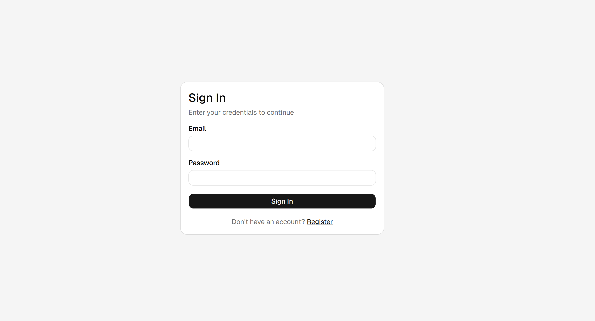
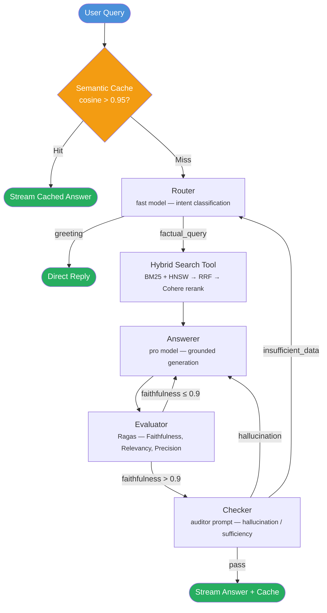
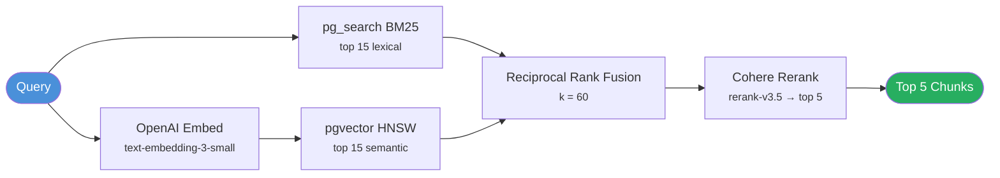

# Agentic RAG

[](https://python.org)
[](https://react.dev)
[](https://fastapi.tiangolo.com)
[](https://langchain-ai.github.io/langgraph/)
[](LICENSE)

**Production-grade RAG for Document Intelligence.**

A self-correcting agentic pipeline that retrieves, generates, and validates answers from your documents — with zero GPU requirements.

---

## Overview

Agentic RAG is a full-stack document intelligence system which can be customized by users with skills to built for high-stakes domains like finance and legal. It orchestrates a 5-node LangGraph pipeline (Router, Retriever, Answerer, Evaluator, Checker) that self-corrects up to 3 iterations before returning a response. Hybrid search combines in-database BM25, HNSW vector similarity, and Cohere reranking for precise retrieval. Multi-tenant data isolation is enforced at the database level via PostgreSQL Row-Level Security, and a Redis semantic cache skips the full pipeline for near-duplicate queries. All inference is API-based — deploy anywhere Docker runs.

---

## Screenshots

| Login | Main Dashboard | Interactive API Docs |
|:---:|:---:|:---:|
|  |  |  |

---

## Key Features

- **Self-correcting agent loop** — Router &rarr; Retriever &rarr; Answerer &rarr; Evaluator &rarr; Checker with feedback loops (max 3 iterations)
- **Knowledge base management** — Build and manage multiple knowledge bases per user, each with its own set of uploaded documents and isolated data
- **Extensible Agent Personas** — Upload custom `.md` skill files that can be combined with any knowledge base, allowing the same documents to power different specialized reasoning styles for versatile domain expertise
- **Automated quality gates** — Ragas evaluation (Faithfulness, Relevancy, Context Precision); faithfulness > 0.9 bypasses checker
- **3-stage hybrid search** — BM25 (pg_search) + HNSW vector (pgvector) &rarr; Reciprocal Rank Fusion &rarr; Cohere rerank
- **Semantic caching** — Redis VSS with cosine > 0.95 threshold; near-duplicate queries skip the full pipeline
- **Multi-tenant isolation** — PostgreSQL RLS on all data tables; every query scoped to `user_id`
- **SSE streaming** — Real-time agent thinking steps + answer tokens streamed to the frontend
- **API-only inference** — Claude (LLM) + OpenAI (embeddings) + Cohere (rerank) + LlamaParse (parsing); no GPU needed
- **Production infrastructure** — Traefik TLS, tiered rate limiting, CSP headers, CI/CD to GHCR

---

## Tech Stack

| Layer | Technology |
|---|---|
| **LLM** | Claude (Anthropic) via `langchain-anthropic` |
| **Embeddings** | OpenAI `text-embedding-3-small` (1536d, Matryoshka-truncatable) |
| **Reranking** | Cohere Rerank API (`rerank-v3.5`) |
| **Document Parsing** | LlamaParse API (PDF, DOCX &rarr; structured Markdown) |
| **Orchestration** | LangGraph (StateGraph with conditional edges) |
| **Evaluation** | Ragas (Faithfulness, Answer Relevancy, Context Precision) |
| **Backend** | FastAPI + SQLModel + Alembic + Pydantic Settings |
| **Frontend** | React 19 + Vite + TypeScript + TanStack Router/Query + Tailwind + shadcn/ui |
| **Database** | ParadeDB (PostgreSQL + pgvector + pg_search built-in) |
| **Cache / Queue** | Redis Stack (RediSearch VSS + RedisJSON) + arq async workers |
| **Observability** | Phoenix (OpenTelemetry traces via OTLP/gRPC) |
| **Reverse Proxy** | Traefik v3.3 (ACME TLS, Docker provider, dynamic middleware) |
| **CI/CD** | GitHub Actions &rarr; GHCR |

---

## Agent Workflow

### Main Pipeline



### Hybrid Search Detail



---

## Technical Decisions

<details>
<summary><b>Why HNSW over IVFFlat?</b></summary>

HNSW provides better recall without a training step. IVFFlat requires pre-clustering with `CREATE INDEX ... WITH (lists = N)` and periodic retraining as data grows. HNSW delivers consistent high recall with no maintenance.
</details>

<details>
<summary><b>Why Matryoshka dimension truncation?</b></summary>

OpenAI's `text-embedding-3-*` models support a native `dimensions` parameter. Truncating from 1536 to 512 dimensions reduces storage by 66% and speeds up similarity search with minimal recall loss — no re-embedding needed. This can save much memory space for users if their knowledge base getting pretty massive. 
</details>

<details>
<summary><b>Why in-database BM25 (pg_search) over rank_bm25?</b></summary>

pg_search runs BM25 inside PostgreSQL. The index survives restarts, respects RLS policies, and requires no separate process. In-memory libraries like `rank_bm25` lose state on restart and can't enforce row-level security.
</details>

<details>
<summary><b>Why Reciprocal Rank Fusion (RRF)?</b></summary>

RRF merges ranked lists with a single parameter (k=60). It's score-distribution-agnostic — no need to normalize BM25 and cosine similarity scores to a common scale before combining.
</details>

<details>
<summary><b>Why Cohere Rerank over a local cross-encoder?</b></summary>

A local cross-encoder (e.g., `sentence-transformers`) pulls in PyTorch and 2 GB+ of dependencies. Cohere's Rerank API provides state-of-the-art relevance scoring without any GPU or heavy library requirements.
</details>

<details>
<summary><b>Why ParadeDB?</b></summary>

ParadeDB bundles pgvector and pg_search in a single PostgreSQL image. One database handles both vector similarity and BM25 full-text search — no Elasticsearch, no separate Weaviate/Qdrant cluster.
</details>

<details>
<summary><b>Why Redis VSS for semantic caching?</b></summary>

Redis Stack includes RediSearch with vector similarity search. Embedding the query and comparing against cached query embeddings (cosine > 0.95) allows near-duplicate queries to skip the full LangGraph pipeline entirely. TTL-based expiry keeps the cache fresh.
</details>

<details>
<summary><b>Why Ragas evaluation in the loop?</b></summary>

Ragas scores (Faithfulness, Answer Relevancy, Context Precision) provide quantitative quality gates. If faithfulness > 0.9, the answer is trustworthy enough to bypass the checker node — reducing latency for high-quality responses.
</details>

<details>
<summary><b>Why two-stage chunking?</b></summary>

Stage 1 (MarkdownHeaderTextSplitter) preserves document structure — headers, tables, and lists stay intact. Stage 2 (RecursiveCharacterTextSplitter) handles oversized sections. A final BPE token guard via tiktoken ensures no chunk exceeds the embedding model's token limit.
</details>

<details>
<summary><b>Why API-only inference?</b></summary>

No PyTorch, no CUDA, no model downloads. The entire stack runs on any machine with Docker. LLM (Anthropic), embeddings (OpenAI), reranking (Cohere), and parsing (LlamaParse) are all API calls. This keeps the Docker images small and deployment simple.
</details>

---

## Project Structure

```
/
├── backend/
│   ├── app/
│   │   ├── main.py                 # FastAPI app, lifespan, router mounts
│   │   ├── core/                   # config, security (JWT), database engine
│   │   ├── models/                 # SQLModel tables (user, kb, document, chunk, conversation, message)
│   │   ├── api/                    # route handlers (auth, knowledge_bases, documents, chat, skills)
│   │   ├── agent/                  # LangGraph pipeline
│   │   │   ├── graph.py            # StateGraph definition and compilation
│   │   │   ├── state.py            # AgentState TypedDict
│   │   │   ├── nodes/              # router, answerer, checker
│   │   │   └── tools/              # hybrid_search (BM25 + vector → RRF → rerank)
│   │   ├── services/               # embedding, reranker, cache, ingestion
│   │   └── workers/                # arq async ingestion worker
│   ├── tests/                      # pytest test suite
│   ├── pyproject.toml
│   └── Dockerfile
├── frontend/
│   ├── src/
│   │   ├── routes/                 # TanStack file-based routing
│   │   ├── components/             # chat, knowledge-base, ui (shadcn)
│   │   └── lib/                    # api client, auth helpers, query client
│   ├── package.json
│   └── Dockerfile
├── traefik/
│   ├── traefik.yml                 # static config (entrypoints, ACME, providers)
│   └── dynamic/middlewares.yml     # security headers, rate limiting
├── .github/workflows/
│   ├── ci.yml                      # lint + test + Docker build on push/PR
│   └── cd.yml                      # build + push to GHCR on main
├── docker-compose.yml              # production (Traefik-routed)
├── docker-compose.override.yml     # dev overrides (exposed ports, hot reload)
├── Makefile
└── .env                            # secrets (never committed)
```

---

## Getting Started

### Prerequisites

- **Docker** + **Docker Compose v2**
- API keys for: [Anthropic](https://console.anthropic.com/), [OpenAI](https://platform.openai.com/), [Cohere](https://dashboard.cohere.com/), [LlamaParse](https://cloud.llamaindex.ai/) or any API Gateway like OpenRouter,AWS RockBed..

### Setup

```bash
# Clone the repository
git clone https://github.com/YOUR_USERNAME/agentic-rag.git
cd agentic-rag

# Configure environment
cp .env.example .env
# Edit .env with your API keys:
#   ANTHROPIC_API_KEY, OPENAI_API_KEY, COHERE_API_KEY, LLAMA_CLOUD_API_KEY
#   SECRET_KEY (generate with: openssl rand -hex 32)
```

---

## Development

Start all services with hot reload and exposed ports:

```bash
make dev    # docker compose up -d (uses override for dev mode)
```

| Service | URL |
|---|---|
| Frontend (Vite HMR) | http://localhost:5173 |
| Backend API | http://localhost:8000/api |
| Auth endpoints | http://localhost:8000/auth |
| Health check | http://localhost:8000/health |
| PostgreSQL | localhost:5432 |
| Redis | localhost:6379 |
| RedisInsight | http://localhost:8001 |
| Phoenix (traces) | http://localhost:6006 |
| Traefik Dashboard | http://localhost:8080 |

Run database migrations:

```bash
make migrate    # alembic upgrade head inside the backend container
```

### Backend Development (outside Docker)

```bash
cd backend
uv venv && source .venv/bin/activate
uv sync
uv run uvicorn app.main:app --reload
```

### Frontend Development (outside Docker)

```bash
cd frontend
pnpm install
pnpm dev
```

---

## Production

Deploy with Traefik handling TLS and routing:

```bash
make prod    # docker compose -f docker-compose.yml up -d (no override)
```

All traffic flows through Traefik on ports 80/443. No individual service ports are exposed.

### Routing

| Route | Service | Priority |
|---|---|---|
| `/api/*`, `/auth/*`, `/health` | Backend | 10 |
| `/phoenix/*` | Phoenix | 10 |
| `/*` (fallback) | Frontend | 1 |

### Rate Limiting

| Tier | Scope | Limit |
|---|---|---|
| General | Frontend routes | 100 req/s (burst 50) |
| API | Backend routes | 30 req/s (burst 20) |
| Auth | Login/register | 5 req/min (burst 10) |

### Security Headers

CSP, HSTS (1 year, preload), X-Content-Type-Options, X-Frame-Options (deny), Referrer-Policy — applied via Traefik dynamic middleware.

---

## Data Flow

### Document Ingestion

```
Upload (PDF/DOCX)
  → FastAPI saves metadata, enqueues arq job
  → arq worker: LlamaParse API → structured Markdown
  → MarkdownHeaderTextSplitter (split on #/##/###)
  → RecursiveCharacterTextSplitter (~400 tokens, 50 overlap)
  → tiktoken BPE guard (≤ 512 tokens per chunk)
  → OpenAI embedding → stored in ParadeDB (pgvector + pg_search)
```

### Chat Query

```
POST /api/chat/{id}/stream
  → JWT validation → set RLS context (user_id)
  → Redis semantic cache check (cosine > 0.95)
  → Cache hit: stream cached answer
  → Cache miss: LangGraph pipeline (Router → Retrieve → Answer → Evaluate → Check)
  → SSE stream each node event to frontend
  → Save to conversations table + Redis cache
```

---

## License

[MIT](LICENSE)
